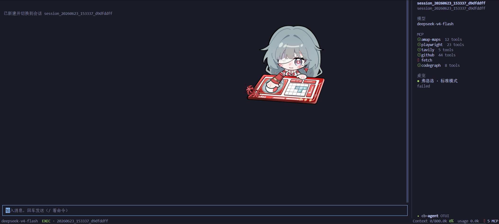

# cb-agent ✨

<p align="center">
  <b>让你的 LLM 长出双手双脚，真的"做到"点什么 (｀・ω・´)</b><br>
  <i>一个会写代码、能调工具、能上 QQ 微信、还能养桌宠的 LLM Agent 框架</i>
</p>

<p align="center">
  
  
  
</p>

<p align="center">
  🧠 <b>零向量依赖即开即用</b> · 🚀 <b>Section/Boundary 静态缓存命中拉满</b><br>
  📱 <b>QQ / 微信 / TUI / CLI 全平台制霸</b> · 🧩 <b>MCP / Skills / Hooks 随便扩展</b>
</p>

---

## 📖 这里有什么？

> cb-agent 是一个**工具箱塞满、四肢发达、头脑也不简单的 coding Agent** ✨
> 不只让大模型"能说会道"，更让它**真的动手干活** ( `･ω･)ﾉ

✨ 默认走轻量 Markdown 记忆，**零向量库、零 embedding、零外部服务**就能跑起来。
✨ 想要更猛的？设置 `CBAGENT_ENABLE_FULL_MEMORY=1` 解锁完整向量记忆与 RAG。

看看它能帮你做什么……(｀・ω・´) ⬇️

---

## 🚀 一分钟！就能跑起来！

```bash
# 1. 拿到项目 (∩´∀｀)∩
git clone <your-fork-url> cb-agent
cd cb-agent

# 2. 搓个虚拟环境 (Windows PowerShell)
python -m venv ..\venv
..\venv\Scripts\Activate.ps1

# 3. 装依赖 ✨
pip install -r requirements.txt && pip install -e .

# 4. 配 .env（填 LLM_MODEL_ID、LLM_API_KEY、LLM_BASE_URL）
Copy-Item .env.example .env

# 5. 启动！！ヽ(✧∀✧)ﾉ
python run_agent.py
```

> 详细的安装姿势请看 [📚 部署与配置](docs/部署与配置.md) 喵~

---

## 💫 功能亮点

| 能力 | 说明 |
|---|---|
| 🔄 多轮 Function Calling | 流式 tool_calls 分片累积、tool result 回灌 |
| ⚡ 高缓存命中上下文 | System message 纯静态化，动态内容塞独立 user 消息；Section 级 LRU 缓存（100 条），跨轮复用 provider KV cache，**快就一个字** |
| 🎣 Hooks 生命周期钩子 | `SessionStart` / `UserPromptSubmit` / `PreToolUse` / `PostToolUse` / `PreCompact` / `Stop`，双向可阻断，想怎么拦截就怎么拦截 |
| 📝 三层 Markdown 记忆 | 全局/项目/短期，默认启用，**零向量依赖** |
| 🧠 旧向量记忆/RAG | 可选 `--memory-system full`，Episodic/Semantic/Working 三层全开 |
| 🔀 多会话隔离 | 新建 / 切换 / 清理，不同会话 history/state 互不打扰 |
| 🎨 多模态输入 | 图片直接发给多模态模型 / 纯文本模型自动 OCR；音频直接 ASR |
| 🖥️ TUI / OTUI | Ink/React 版 + OpenTUI+Solid.js 重构版，**颜值在线** |
| 💬 QQ / NapCat | OneBot V11 反向 WebSocket，群聊私聊隔离，敏感权限门禁 (｀・ω・´) |
| 💬 微信 OC | HTTP 长轮询，扫码登录嗖嗖快，CDN 媒体上传 |
| 🔌 MCP | 读 `mcp.json` 起 MCP server，工具自动展开 |
| 📜 Skills | Markdown 声明式工作流 + 附带脚本，**想加啥加啥** |
| 🐱 桌宠 | Python 原生透明置顶小可爱，兼容 BongoCat Live2D 和 spritesheet |

---

## 🖼️ 长这样！

<p align="center">
  <br>
  <em>✨ OTUI — 三栏布局，左侧对话、右侧 Sidebar、底部状态栏</em>
</p>

<br>

<p align="center">
  <br>
  <em>🐱 桌宠浮窗 + OTUI 同屏展示</em>
</p>

<br>

<p align="center">
  
  
  <br>
  <em>💬 QQ 群聊 &nbsp;&nbsp;&nbsp; 📱 微信私聊</em>
</p>

---

## 📚 文档索引 (づ｡◕‿‿◕｡)づ

| 文档 | 里面有什么 |
|---|---|
| [📖 项目介绍](docs/项目介绍.md) | 项目定位、架构图、完整能力表、平台展示图片 |
| [📦 部署与配置](docs/部署与配置.md) | 环境准备、安装（light/full）、.env 配置、CLI/TUI/OTUI/QQ/微信/Linux 启动 |
| [🔧 功能详解](docs/功能详解.md) | 记忆系统（light/full/off）、会话 & compact、桌宠、工具系统、MCP、Skills、CLI 命令 |
| [🧑‍💻 开发指南](docs/开发指南.md) | 项目结构、五大子系统、缓存命中设计、Hooks、测试命令、技术报告、FAQ |

---

## 🙏 致谢

- [**BongoCat**](https://github.com/ayangweb/BongoCat) — 桌宠功能的灵感来源，感谢这么可爱的桌宠项目 (｀・ω・´)

## 📜 License

MIT (｀・ω・´) 随便用，随便改！
