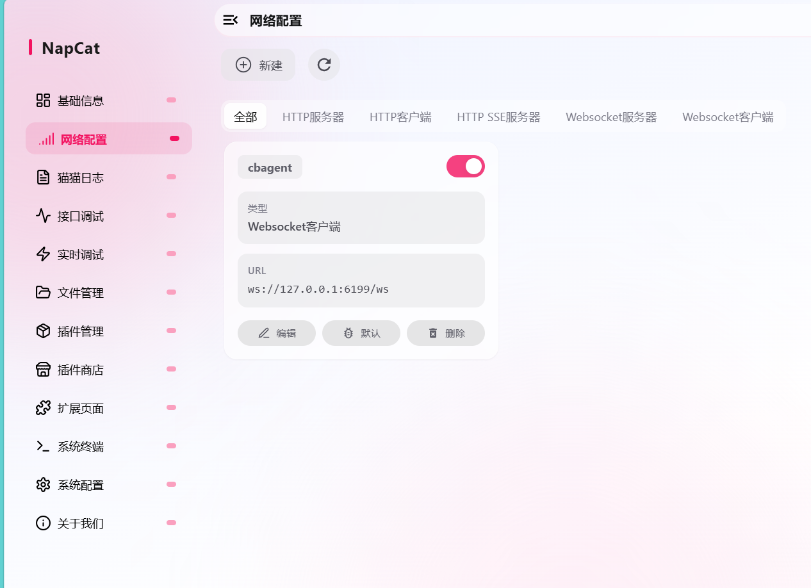
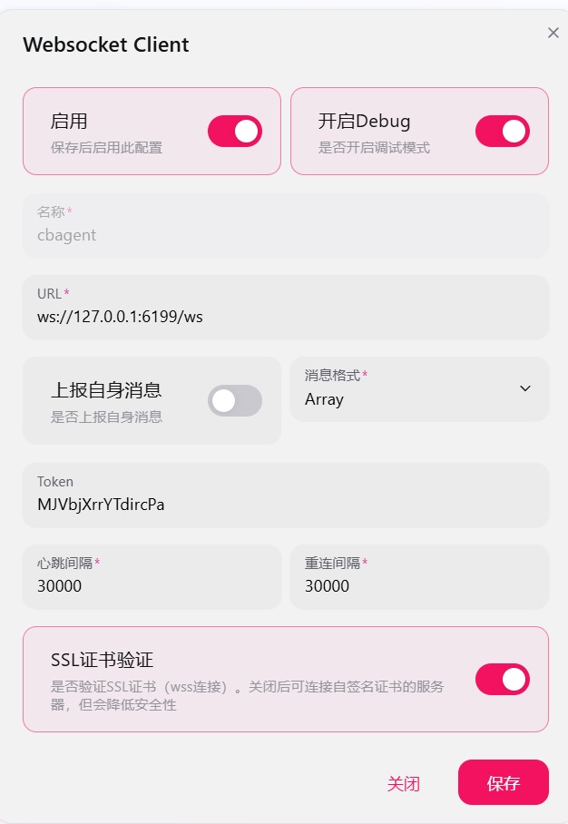

# 部署与配置

## 目录

- [环境准备](#环境准备)
- [安装步骤](#安装步骤)
- [配置 .env](#配置-env)
- [启动 CLI](#启动-cli)
- [启动 TUI](#启动-tui)
- [启动 OTUI（推荐）](#启动-otui推荐)
- [启动 QQ / NapCat](#启动-qq--napcat)
- [启动微信 OC](#启动-微信-oc)
- [多模态输入](#多模态输入)
- [Linux 部署](#linux-部署)

---

## 环境准备

### 必需

- Python `>=3.10`
- 一个 OpenAI-compatible LLM 服务，至少提供 `LLM_MODEL_ID`、`LLM_API_KEY`、`LLM_BASE_URL`

### TUI 额外依赖

- Node.js `>=20`
- npm
- 剪贴板图片粘贴：Windows 使用 PowerShell/.NET Clipboard；macOS 推荐 `pngpaste`；Linux 推荐 `wl-paste` 或 `xclip`

### MCP 额外依赖

- 能运行 `npx`
- `mcp.json` 中相关服务需要的环境变量（如 `AMAP_MAPS_API_KEY`）

### QQ / NapCat 额外依赖

- 已登录并启用 OneBot V11 反向 WebSocket 的 NapCat
- Python 依赖中的 `websockets`

### 微信 OC 额外依赖

- 能访问个人微信 OC HTTP API（默认 `https://ilinkai.weixin.qq.com`）
- Python 依赖中的 `requests`、`pycryptodome` 和 `qrcode`
- 首次启动需要在终端扫码登录；token 会保存到 `.cbagent/wechat/state.json`

---

## 安装步骤

### 1. 克隆并进入项目

```bash
git clone <your-fork-url> cb-agent
cd cb-agent
```

### 2. 创建 Python 虚拟环境

Windows PowerShell：

```powershell
python -m venv ..\venv
..\venv\Scripts\Activate.ps1
python -m pip install --upgrade pip
```

macOS / Linux：

```bash
python3 -m venv ../venv
source ../venv/bin/activate
python -m pip install --upgrade pip
```

> TUI 会优先查找 `../venv/python.exe`、`../venv/Scripts/python.exe` 或 `../venv/bin/python`，所以推荐把虚拟环境放在项目父目录的 `venv`。

### 3. 安装依赖

**轻量安装（默认，推荐先跑起来）：**

```bash
pip install -e .
# 或
pip install -r requirements.txt
```

**完整安装（启用旧向量记忆/RAG、多模态 RAG、PDF 等可选依赖）：**

```bash
pip install -e ".[full]"
# 或
pip install -r requirements-full.txt
```

两种安装模式的区别：

| 模式 | 命令 | 默认记忆 | 是否注册 `memory` / `rag` | 适合场景 |
|---|---|---|---|---|
| light | `pip install -e .` | Markdown 文件 | 否 | 先跑起来、低依赖、无需向量库 |
| full | `pip install -e ".[full]"` + `CBAGENT_ENABLE_FULL_MEMORY=1` | 旧向量记忆/RAG | 是 | 需要 embedding、RAG、多模态、向量/图存储 |

---

## 配置 .env

复制模板并填写至少必需的 LLM 配置：

```bash
# Windows PowerShell
Copy-Item .env.example .env

# macOS / Linux
cp .env.example .env
```

### 最小配置

```env
LLM_MODEL_ID=deepseek-v4-flash
LLM_API_KEY=your_api_key
LLM_BASE_URL=https://your-provider.example/v1
LLM_TIMEOUT=60
```

> **注意**：`LLM_MODEL_ID` 可以继续使用；如果模型没有在 [constant/llm/constant_llm.py](../constant/llm/constant_llm.py) 登记，请补全 `is_tool`、`is_reasoning`、`max_tokens`、`image_ability`，或改用下面的统一模型配置文件。

### 统一模型配置

可以把多个 provider 和模型统一写到 `.cbagent/models.json`。OTUI 中输入 `/model` 会打开模型选择窗，方向键切换，回车确认；切换模型只重建 LLM client，不清空当前会话上下文。

```json
{
  "providers": [
    {
      "name": "Kimi",
      "options": {
        "baseURL": "https://api.moonshot.cn/v1",
        "apiKey": "your_api_key"
      },
      "models": {
        "kimi-k2.7-code": {
          "name": "Kimi K2.7 Code",
          "is_tool": true,
          "is_reasoning": true,
          "max_tokens": 1000000,
          "image_ability": true
        }
      }
    }
  ]
}
```

字段缺省时会回退到 `ConstantLLM.llm_dict`，再回退到保守默认值；`CBAGENT_MODEL_CONFIG=/path/to/models.json` 可指定其它配置文件路径。

### 日志等级

```env
# basic | detail | full
CBAGENT_LOG_LEVEL=basic
CBAGENT_LOG_DIR=.cbagent/logs
```

- `basic`：记录启动、会话、工具、网关、错误等关键生命周期日志
- `detail`：增加每轮 think、工具调度、RPC 分发和 messages 摘要日志
- `full`：开启 DEBUG；对话 messages 日志始终完整写入 `conversation-*.jsonl`

日志路径：
- 系统运行日志：`.cbagent/logs/system/cb-agent-<timestamp>.log`
- TUI 后端 stderr：`.cbagent/logs/system/gateway-<timestamp>.log`
- 完整对话日志：`.cbagent/logs/conversations/conversation-*.jsonl`

### 自定义系统提示词

长期稳定的系统提示词集中在 [constant/system_prompt.py](../constant/system_prompt.py)，修改 `ConstantSystemPrompt` 即可调整 agent 基础行为：

```python
class ConstantSystemPrompt:
    USER_COSPLAY_PROMPT = "你是一位耐心、严格、偏工程审查风格的资深架构师。"
```

当前时间、cwd、工具列表、MCP instructions、运行时 UI 状态、记忆内容等动态内容由上下文系统自动拼接。

### 可选环境变量速查

| 变量 | 用途 |
|---|---|
| `AMAP_MAPS_API_KEY` | mcp.json 里的高德 MCP server |
| `TAVILY_API_KEY` | my_advanced_search 的 Tavily 搜索源 |
| `SERPAPI_API_KEY` | my_advanced_search 的 SerpApi 搜索源 |
| `CBAGENT_DANGEROUSLY_SKIP_PERMISSIONS` | 设为 1 后跳过 Bash 权限确认 |
| `CBAGENT_ATTACHMENT_MAX_MB` | 单个多模态附件大小上限，默认 20 MB |
| `OCR_API_KEY` / `OCR_BASE_URL` / `OCR_MODEL_NAME` | 纯文本基模处理图片附件时的 OCR/视觉描述模型 |
| `ASR_API_KEY` / `ASR_BASE_URL` / `ASR_MODEL_NAME` | 音频附件转写为文本时使用的 ASR 模型 |
| `CBAGENT_ENABLE_FULL_MEMORY` | 设为 1 启用旧向量记忆/RAG/embedding |
| `VECTOR_STORE_TYPE` / `QDRANT_URL` / `QDRANT_API_KEY` | full 模式向量存储 |
| `GRAPH_STORE_TYPE` / `NEO4J_URI` / `NEO4J_USERNAME` / `NEO4J_PASSWORD` | full 模式语义记忆图存储 |
| `EMBED_MODEL_TYPE` / `EMBED_MODEL_NAME` / `EMBED_API_KEY` | full 模式 embedding 配置 |

QQ/微信相关变量见对应章节。

`.env` 已被 `.gitignore` 忽略，不会进仓库。

---

## 启动 CLI

默认使用轻量 Markdown 记忆：

```bash
python run_agent.py
```

等价于：

```bash
python run_agent.py --memory-system light
```

常用启动参数：

```bash
python run_agent.py --memory-system off
python run_agent.py --memory-system full
python run_agent.py --no-mcp
python run_agent.py --no-ctx
```

危险权限模式（跳过权限确认和非只读检查）：

```bash
python run_agent.py --dangerously-skip-permissions
```

CLI 里建议先试试：

```
/tools
/skills
帮我看一下这个项目有哪些核心模块
```

退出：

```
/quit
```

---

## 启动 TUI

```bash
cd ui-tui
npm install
npm start
```

TUI 会自动 spawn：

```bash
python run_agent.py --transport jsonrpc --memory-system light
```

### 指定 Python 路径

Windows PowerShell：

```powershell
$env:CB_AGENT_PYTHON="C:\Users\cb135\Desktop\cbAgent\venv\Scripts\python.exe"
npm start
```

macOS / Linux：

```bash
CB_AGENT_PYTHON=/path/to/cbAgent/venv/bin/python npm start
```

### 开启危险权限模式

```bash
CBAGENT_DANGEROUSLY_SKIP_PERMISSIONS=1 npm start
```

### TUI 快捷键

| 快捷键 / 命令 | 说明 |
|---|---|
| `Enter` | 发送输入 |
| `/` | 打开 slash command picker |
| `/tools` | 列出后端注册工具 |
| `/sessions` | 打开本地会话切换面板 |
| `/new` | 新建并切换到空白会话 |
| `/switch <id>` | 切换到指定 session |
| `/compact` | 手动压缩当前会话上下文 |
| `/pet` | 管理轻量桌宠 runtime 与宠物包 |
| `/attach <path>` | 添加本地图片或音频附件到下一轮消息 |
| `/paste-image` | 从系统剪贴板读取图片并加入附件队列 |
| `/attachments` | 查看待发送附件队列 |
| `/detach <index\|all>` | 移除一个或全部待发送附件 |
| `/clear` | 清空前端显示并清空后端当前会话历史 |
| `/log` 或 `Ctrl-O` | 切换后端日志面板 |
| `Ctrl-V` | 尝试读取剪贴板图片；部分终端会拦截，建议用 `/paste-image` |
| `Ctrl-L` | 清当前屏幕显示，保留后端 history |
| `Ctrl-C` | busy 时取消当前回答；空闲时退出 |

底部状态栏显示：当前模型、当前 session、Context 使用率、OpenAI usage 累计、工具循环 round。

---

## 启动 OTUI（推荐）

`ui-otui/` 是基于 OpenTUI + Solid.js（运行在 Bun 上）重写的新 TUI，根治了旧 Ink 版的两个顽疾：流式输出时滚轮跳顶、长按 delete 失灵。

前置：安装 [Bun](https://bun.sh) >= 1.3.14。

```bash
cd ui-otui
bun install
bun start
```

Python 路径解析、`CB_AGENT_PYTHON` 覆盖、`CBAGENT_DANGEROUSLY_SKIP_PERMISSIONS` 透传逻辑与旧 TUI 相同。三栏布局：左侧消息流 + 输入框，右侧 Sidebar（会话/模型/MCP），底部 Footer 状态栏。

> 旧的 `ui-tui/`（Ink 版）暂时保留作为回退，后续确认稳定后会移除。

---

## 启动 QQ / NapCat

QQ 接入使用 NapCat 的 OneBot V11 反向 WebSocket。cb-agent 负责启动 WebSocket 服务，NapCat 主动连接进来。

### 最小配置

```env
QQ_ENABLE=1
QQ_HOST=127.0.0.1
QQ_PORT=6199
QQ_ACCESS_TOKEN=
QQ_GROUP_MODE=mention
QQ_WAKE_PREFIX=/agent
```

### 启动 cb-agent

```bash
..\venv\python.exe run_agent.py --transport qq
```

### NapCat 安装与配置

去 [NapCatQQ Releases](https://github.com/NapNeko/NapCatQQ/releases) 下载最新版本，按说明启动后进入 WebUI。

Linux 服务器 Docker 部署：

```bash
curl -o napcat.sh https://nclatest.znin.net/NapNeko/NapCat-Installer/main/script/install.sh && sudo bash napcat.sh --docker y --qq your_qq --mode ws --proxy 1 --confirm
```

如果需要 agent 发送本地文件，建议手动创建容器并挂载共享目录：

```bash
docker run -d \
  -e NAPCAT_GID=$(id -g) \
  -e NAPCAT_UID=$(id -u) \
  -e ACCOUNT=your_qq \
  -e WS_ENABLE=true \
  -p 3001:3001 \
  -p 6099:6099 \
  -v ./QQ:/app/.config/QQ \
  -v ./config:/app/napcat/config \
  -v ./plugins:/app/napcat/plugins \
  -v /root/CBAGENT/cb-agent/outbound:/app/cb-agent-outbound:ro \
  --name napcat \
  --restart=always \
  mlikiowa/napcat-docker:latest
```

### NapCat WebSocket 客户端配置

在 NapCat WebUI 中打开"网络配置"，选择 **WebSocket 客户端**，地址填写：

```
ws://127.0.0.1:6199/ws
```





### QQ 配置变量全表

| 变量 | 说明 |
|---|---|
| `QQ_ENABLE` | 是否启用 QQ transport；设为 1 后 `--transport qq` 会监听 |
| `QQ_HOST` / `QQ_PORT` | 监听地址和端口 |
| `QQ_ACCESS_TOKEN` | 可选访问令牌 |
| `QQ_GROUP_MODE` | 群聊唤醒策略：`mention`、`prefix` 或 `all` |
| `QQ_WAKE_PREFIX` | 群聊文本唤醒前缀 |
| `QQ_ALLOWED_GROUPS` | 群白名单，逗号分隔 |
| `QQ_ALLOWED_USERS` | 用户白名单，逗号分隔 |
| `QQ_ROOT_USERS` | root 用户，逗号分隔；可执行敏感工具 |
| `IM_ROOT_USERS` | 通用多人通讯平台 root 用户 |
| `QQ_ACTION_TIMEOUT_SECONDS` | OneBot action 超时 |
| `QQ_GROUP_CONTEXT_MESSAGES` | 群聊被唤醒时注入最近 xx 条消息（默认 50） |
| `QQ_GROUP_CONTEXT_MAX_CHARS` | 群聊上下文最大字符数（默认 8000） |
| `CBAGENT_MCP_PUBLIC_PREFIXES` / `CBAGENT_MCP_SENSITIVE_PREFIXES` | MCP 工具权限前缀分类 |
| `IM_EVENT_VERBOSITY` | 事件输出等级：`normal` / `full` |
| `IM_GROUP_TOOL_MESSAGES` | 群聊是否显示工具过程消息 |
| `IM_SHOW_REASONING` | 是否把思考内容发到 QQ/微信 |
| `IM_REASONING_CHUNK_CHARS` / `IM_REASONING_MAX_CHARS` | 思考消息分段参数 |
| `IM_CONFIRM_QUESTION_ANSWER` | 编号回答后是否发送确认 |
| `CBAGENT_STICKER_DIR` | 表情包目录，默认 `./assets/stickers` |
| `CBAGENT_OUTBOUND_FILE_MAX_MB` | 发送文件大小上限 |
| `QQ_FILE_DELIVERY_MODE` | 出站文件交付方式：`auto` / `mapped_path` / `http` / `base64` / `path` |
| `QQ_FILE_HOST_PREFIX` / `QQ_FILE_NAPCAT_PREFIX` | mapped_path 模式路径对应 |
| `QQ_FILE_SHARED_TTL_SECONDS` / `QQ_FILE_SHARED_MAX_FILES` | 共享目录清理策略 |
| `QQ_FILE_HTTP_HOST` / `QQ_FILE_HTTP_PORT` / `QQ_FILE_HTTP_PUBLIC_BASE_URL` | HTTP 临时文件服务 |
| `QQ_FILE_HTTP_TTL_SECONDS` | HTTP URL 有效期（默认 300s） |
| `QQ_FILE_BASE64_MAX_MB` | base64 内联最大文件大小 |
| `CBAGENT_PLATFORM_ATTACHMENT_DIR` | QQ 图片/音频 URL 下载目录 |

### 敏感工具门禁

QQ 模式有敏感工具门禁。`QQ_ALLOWED_USERS` 决定谁能触发 agent 聊天，`QQ_ROOT_USERS` / `IM_ROOT_USERS` 决定谁能执行敏感工具（读/写文件、非只读 bash、git 操作、memory/rag 写操作等）。未配置 root 用户时，敏感工具会在执行前直接拒绝。

---

## 启动微信 OC

微信接入使用个人微信 OC HTTP 协议。cb-agent 主动扫码登录、长轮询收消息。

### 最小配置

```env
WECHAT_ENABLE=1
WECHAT_BASE_URL=https://ilinkai.weixin.qq.com
WECHAT_CDN_BASE_URL=https://novac2c.cdn.weixin.qq.com/c2c
WECHAT_STATE_FILE=.cbagent/wechat/state.json
CBAGENT_PLATFORM_ATTACHMENT_DIR_WECHAT=.cbagent/platform_attachments/wechat
```

### 启动

```bash
..\venv\python.exe run_agent.py --transport wechat
```

第一次启动时，终端会打印登录二维码。用手机微信扫码确认后，token 会保存到 `.cbagent/wechat/state.json`，后续重启自动恢复。

### 微信配置变量全表

| 变量 | 说明 |
|---|---|
| `WECHAT_ENABLE` | 是否启用微信 OC transport |
| `WECHAT_BASE_URL` | 微信 OC API 地址 |
| `WECHAT_CDN_BASE_URL` | 微信媒体 CDN 地址 |
| `WECHAT_TOKEN` / `WECHAT_ACCOUNT_ID` | 登录凭据，可留空扫码登录 |
| `WECHAT_BOT_TYPE` | 扫码登录使用的 bot_type，默认 3 |
| `WECHAT_API_TIMEOUT_MS` / `WECHAT_LONG_POLL_TIMEOUT_MS` | API 与长轮询超时 |
| `WECHAT_STATE_FILE` | 本地状态文件 |
| `CBAGENT_PLATFORM_ATTACHMENT_DIR_WECHAT` | 微信媒体下载目录 |
| `WECHAT_ACTION_TIMEOUT_SECONDS` | wechattool 超时时间 |

### 微信模式特性

- 最终回答、思考内容、工具过程提示由事件系统自动发送
- 额外发送内容可通过 `wechattool`：`send_text`、`send_image`、`send_file`、`send_typing`、`get_status`
- 媒体发送走 CDN 上传（`getuploadurl -> upload -> sendmessage`），不需要 Docker 共享目录
- 只处理私聊消息，群聊消息会被忽略

---

## 多模态输入

用户消息支持 `text + attachments[]`。附件只在当前轮参与推理；跨轮只保存文本摘要和元数据，不保存二进制。

### 添加附件

```
/attach C:\Users\cb135\Desktop\shot.png
/attachments
/detach 1
/detach all
```

TUI 额外支持：

```
/paste-image    # 从剪贴板读取图片
Ctrl-V          # 部分终端会拦截
```

### 路由规则

| 附件 | 主模型能力 | 处理方式 |
|---|---|---|
| 图片 | `image_ability == True` | 转为 `image_url` 发给主模型 |
| 图片 | `image_ability == False` | OCR/视觉描述文本发给主模型 |
| 音频 | 任意 | ASR 转写文本发给主模型 |

支持的图片格式：png / jpg / jpeg / webp / gif / bmp / tiff
支持的音频格式：mp3 / wav / m4a / aac / flac / ogg / wma

---

## Linux 部署

### 推荐步骤

```bash
cd /opt/cbAgent/cb-agent
python3 -m venv ../venv
source ../venv/bin/activate
python -m pip install --upgrade pip
pip install -r requirements.txt
cp .env.example .env
# 编辑 .env，至少填好 LLM 配置
```

### 启动

```bash
# CLI
../venv/bin/python run_agent.py

# TUI（指定 Python 路径）
export CB_AGENT_PYTHON=/opt/cbAgent/venv/bin/python
cd ui-tui && npm install && npm start

# QQ
QQ_ENABLE=1 ../venv/bin/python run_agent.py --transport qq

# 微信
WECHAT_ENABLE=1 ../venv/bin/python run_agent.py --transport wechat
```

### MCP 和 Playwright

Linux 上需要 Node.js/npm，并保证 `npx` 在 PATH 中。Playwright MCP 首次使用可能需要：

```bash
npx playwright install --with-deps
```

暂时不需要 MCP 可跳过：

```bash
../venv/bin/python run_agent.py --no-mcp
```

### 剪贴板图片粘贴

| 环境 | 依赖 | 说明 |
|---|---|---|
| Wayland | `wl-paste`（`wl-clipboard`） | 有桌面会话时可用 |
| X11 | `xclip` | 有桌面会话时可用 |
| 纯 SSH / headless | 无系统剪贴板 | 使用 `/attach <path>` |

### systemd 示例

```ini
[Unit]
Description=cb-agent QQ transport
After=network-online.target
Wants=network-online.target

[Service]
Type=simple
User=cbagent
WorkingDirectory=/opt/cbAgent/cb-agent
EnvironmentFile=/opt/cbAgent/cb-agent/.env
ExecStart=/opt/cbAgent/venv/bin/python run_agent.py --transport qq
Restart=on-failure
RestartSec=5

[Install]
WantedBy=multi-user.target
```

### 验证安装

```bash
python run_agent.py --help
python test/test_context_builder.py
python test/test_session_renderer.py
python test/test_transport.py
```

Linux 部署前运行自检脚本：

```bash
python3 scripts/check_linux_deploy.py
```
