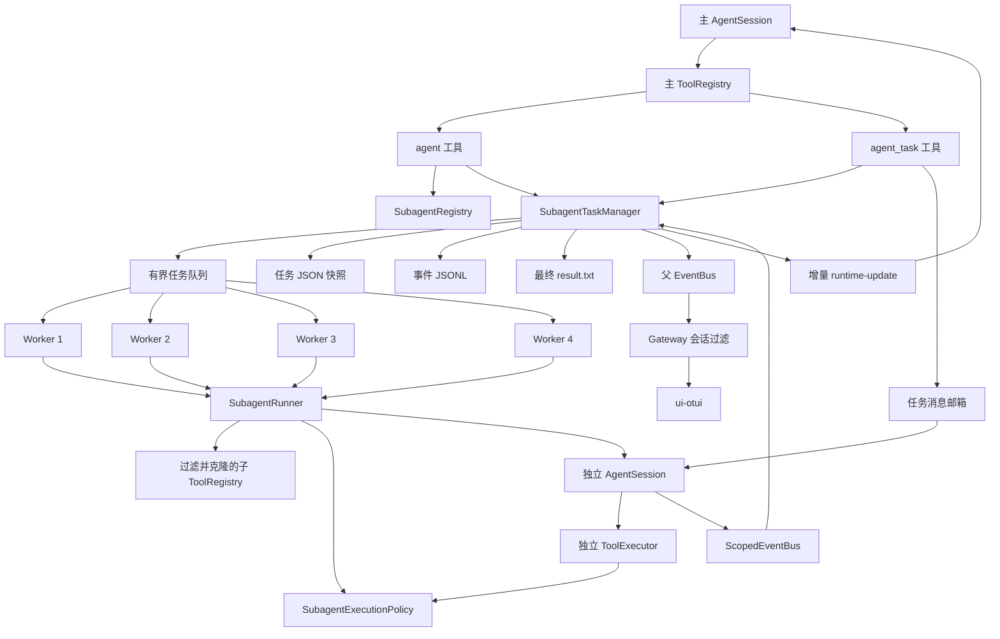

# Subagent 大版本技术实现报告

> 报告日期：2026-07-12
>
> 核心实现提交：`f3d55a2a64d6c21f117b4e1fa8424bec8a7efcd6`（`优化subagent功能`）
>
> 分析基线：上述提交后的当前项目代码
>
> 适用范围：`subagent/` 核心包、子代理工具装配、会话集成、权限执行、事件传输及 OTUI 展示

## 1. 报告摘要

本次更新不是对旧版 Subagent 的局部修补，而是把原先集中在
`agent/subagents.py` 和 `tools/tools/subagent_tool.py` 中的简单后台线程实现，重构为一个具备
明确分层、并发调度、实时进度、会话归属、权限隔离、任务恢复和角色扩展能力的子系统。

核心结果如下：

- 后台任务使用固定 worker 池，当前默认最多并行运行 4 个子代理，活动及排队任务上限为 32。
- 主 Agent 可以在同一轮启动多个后台 Subagent，随后继续处理不重叠工作，不再必须立即调用
  `wait`。
- 子代理的模型轮次、Token 使用、工具开始、工具完成、取消和最终结果都进入统一事件流。
- 主 Agent 在每次真正调用模型前自动获得尚未消费的增量进度，解决“只能看到最终输出”的问题。
- `agent_task inspect` 支持按事件游标无阻塞查看当前轮次、正在执行的工具、脱敏参数和累计统计。
- 任务拥有明确的父会话所有权，查询、输出、消息、取消、Gateway 事件和 UI 恢复都按会话隔离。
- 内置 `general`、`explore`、`reviewer`、`worker` 四种角色，每个角色有独立代码文件、提示词、
  工具集合、轮次上限和权限策略。
- 工具权限不只依赖提示词，而是在 `ToolExecutor` 真正执行工具前进行服务端校验。
- 每个子代理具有独立的 `AgentSession`、Bash 工作目录上下文、搜索忽略上下文、图片缓冲、
  工具结果目录、消息日志和取消令牌。
- 任务状态、完整事件日志和最终结果分别持久化，进程重启后未完成任务会进入 `orphaned`，
  不会自动重放可能具有副作用的操作。
- 保留 `agent.subagents` 旧导入路径和 `SubagentTaskRegistry` 旧名称，降低插件和用户脚本迁移成本。

核心提交覆盖后端、测试和 OTUI，因此它是一项跨运行时、协议层和界面的完整能力升级。

## 2. 原实现的主要问题

更新前的实现具备基本的“启动一个子会话并在后台运行”能力，但存在以下结构性限制：

1. 每个后台任务直接创建一个 daemon 线程，没有固定并发池和全局排队上限。
2. 任务状态主要是 `running/done/failed/killed`，无法表达排队、思考、等待工具、正在取消和
   重启遗留等阶段。
3. 子会话虽然会产生部分进度事件，但任务注册表只持久化最终任务 JSON，缺少可按游标消费的
   事件历史和一致状态快照。
4. 主 Agent 主要依靠完成通知或显式 `wait` 获取结果，无法在后续模型轮次自动感知实时进度。
5. 只有一个内置通用角色，未知角色会静默回退到通用角色，可能导致职责和权限降级不透明。
6. 角色只定义工具列表，没有独立的写入、Bash、外部路径和派生权限模型。
7. 子代理会从父注册表获取工具，但缺少统一的有状态工具克隆协议，存在跨线程共享状态风险。
8. 任务没有可靠的父会话所有权，多个本地会话或通讯平台会话可能看到不属于自己的任务。
9. 重启恢复、事件尾部修复、符号链接防护、原子写入和迟到线程覆盖终态等情况没有完整处理。
10. 子代理、主 Agent 和其它子代理之间的 Bash 当前目录、图片缓冲及搜索上下文可能相互影响。

本次实现围绕这些问题建立了新的任务管理器、事件桥接、执行策略和角色注册体系。

## 3. 设计目标与约束

### 3.1 设计目标

- **真正并行**：多个独立 Subagent 可以同时执行，超过并发上限时有界排队。
- **持续可观察**：主 Agent 和 OTUI 可以看到任务当前阶段及工具调用，而不只看到终态。
- **异步优先**：后台启动为默认行为，`wait` 只作为真正的数据依赖屏障。
- **职责明确**：不同角色拥有独立提示词、工具集和最大轮次。
- **执行层授权**：模型即使生成越权工具调用，也不能绕过角色策略。
- **会话隔离**：任务、事件、输出和管理操作只能由所属父会话访问。
- **运行态隔离**：子代理不能污染主 Agent 或其它子代理的有状态工具上下文。
- **可恢复、不可误重放**：重启后可以审计旧任务，但不会自动继续未知副作用的运行。
- **方便扩展**：新增内置角色主要修改 `subagent/list/`，自定义角色可以使用 Markdown 配置。
- **兼容旧接口**：旧导入和旧任务注册表名称继续可用。

### 3.2 明确约束

- 当前权限系统是应用进程内的工具执行边界，不是操作系统级沙箱。
- 当前不允许 Subagent 再派生 Subagent，避免无限递归、资源失控和权限链复杂化。
- 取消是协作式取消，已经进入 Python 线程或外部工具内部的工作不能被强制终止。
- 多个 `worker` 可以并行修改同一工作区，但当前没有文件租约或冲突检测机制。
- 所有角色默认共享父进程的 LLM 客户端和模型配置，没有角色级独立模型选择。

## 4. 总体架构



架构的关键原则是：

- `SubagentTaskManager` 是任务状态的唯一事实来源。
- 子会话原始文本流不会直接混入主 Agent 的回答流。
- 管理器先持久化状态，再向父事件总线广播，UI 和模型读取同一份状态语义。
- 工具定义、任务生命周期、LLM 会话装配和 UI 展示分属不同模块，避免相互反向依赖。

## 5. 模块职责

| 模块 | 主要职责 |
| --- | --- |
| `subagent/models.py` | 定义角色权限、角色定义、任务状态、序列化和旧状态兼容 |
| `subagent/manager.py` | worker 池、队列、生命周期、事件归一、查询、消息、取消、持久化和关闭 |
| `subagent/registry.py` | 加载内置角色、用户 Markdown 角色和项目 Markdown 角色 |
| `subagent/permissions.py` | 在工具执行层校验工具、写权限、Bash 模式、路径和私有目录 |
| `subagent/event_bridge.py` | 隔离子会话事件，并把结构化事件桥接到任务管理器和父事件总线 |
| `subagent/context.py` | 使用 `ContextVar` 传递当前工具调用所属的父会话 ID |
| `subagent/list/*.py` | 每个内置角色的提示词、工具集、轮次和权限定义 |
| `tools/tools/subagent_tool.py` | 实现 `agent`、`agent_task` 和子 `AgentSession` 的运行装配 |
| `tools/toolRegistry.py` | 按角色过滤和安全克隆工具，处理 Bash、Todo、ListTools 特殊依赖 |
| `agent/session.py` | 注入父任务增量、消费子任务邮箱、绑定父会话 ID、清理会话任务 |
| `agent/executor.py` | 执行前权限校验、Hook 改写后复检、工具事件和批内工具并发 |
| `agent/events.py` | 定义 `SubagentStarted/Progress/Completed` 标准事件协议 |
| `agent/transport/gateway.py` | 按 `parent_session_id` 过滤跨会话事件并恢复任务面板 |
| `tools/tools/bash_session.py` | 为子代理提供独立 Bash 当前目录，禁止目录状态写回主会话 |
| `tools/tools/local_search.py` | 使用上下文隔离的额外忽略目录，子代理默认忽略 `.cbagent` |
| `tools/tools/pending_images.py` | 为每次 `AgentSession.chat` 提供独立线程安全图片缓冲 |
| `agent/subagents.py` | 旧导入路径和 `SubagentTaskRegistry` 兼容层 |
| `ui-otui` | 按 `task_id` 聚合展示状态、阶段、工具、Token 和最终结果 |

## 6. 核心数据模型

### 6.1 `SubagentPermissionPolicy`

角色权限由以下字段组成：

| 字段 | 含义 |
| --- | --- |
| `bash_mode` | `deny`、`read_only` 或 `inherit` |
| `workspace_write` | 是否允许使用写入类工具修改当前工作区 |
| `external_paths` | 是否允许访问工作区外路径 |
| `allow_spawn` | 是否允许继续派生子代理；当前解析时强制为 `False` |
| `denied_tools` | 角色额外禁止的工具集合，优先级高于允许列表 |

### 6.2 `SubagentDefinition`

一个角色定义包含：

- 稳定角色名 `name`；
- 面向主 Agent 的职责说明 `description`；
- 注入子 `AgentSession` 的专属系统提示词 `system_prompt`；
- 模型可见工具集合 `tools`；
- 最大工具循环轮次 `max_turns`；
- 角色权限 `permissions`；
- 定义来源 `source_path`；
- 是否内置 `builtin`。

### 6.3 `SubagentTask`

任务对象同时承担可持久化状态和进程内控制句柄两类职责。

可持久化信息包括：

- 标识：`id`、`subagent_id`、`subagent_type`、`owner_session_id`；
- 输入：`description`、`prompt`；
- 文件：`snapshot_path`、`events_path`、`output_path`；
- 生命周期：`status`、`phase`、开始/更新/心跳/结束时间；
- 统计：轮次、工具次数、累计 Token；
- 实时工具：当前工具、全部活跃工具、上一工具和执行耗时；
- 事件：单调递增 `event_seq`、父 Agent 消费游标 `parent_cursor`、近期事件；
- 结果：最终文本、错误、结果预览；
- 控制标志：是否收到取消请求。

只存在于进程内、不写入快照的字段包括：

- `CancelToken`；
- 异步控制句柄预留字段 `future`；
- 保护任务内部状态的可重入锁；
- 运行中的消息邮箱内容。

任务 ID 和子代理实例 ID 是两个不同概念：

- `subagent_id` 用于标识一次子代理实例和 UI 展示；
- `task_id` 用于任务查询、持久化文件和生命周期管理。

## 7. 状态机与阶段

### 7.1 对外状态 `status`

| 状态 | 含义 | 是否终态 |
| --- | --- | --- |
| `queued` | 已提交后台队列，尚未取得 worker | 否 |
| `running` | 子会话正在进行模型思考或收尾 | 否 |
| `waiting_tool` | 一个或多个工具正在运行 | 否 |
| `cancelling` | 已发出取消请求，等待协作式结束 | 否 |
| `completed` | 正常生成最终结果 | 是 |
| `failed` | 运行器、Hook 或其它执行异常导致失败 | 是 |
| `cancelled` | 在开始前或运行中被取消 | 是 |
| `orphaned` | 重启遗留、关闭超时或未知快照状态被隔离 | 是 |

### 7.2 内部阶段 `phase`

`phase` 比 `status` 更细，用于描述当前执行位置，常见值包括：

- `queued`
- `starting`
- `thinking`
- `running_tool`
- `tool_results_ready`
- `finishing`
- `error`
- `cancelling`
- `shutdown`
- `completed`
- `failed`
- `cancelled`
- `orphaned`

`Error` 事件不会立即把任务写成终态，因为模型调用或工具循环可能在错误后继续恢复；最终状态由
`SubagentRunner` 的返回结果和取消令牌共同决定。

### 7.3 主要状态迁移

```text
后台任务：
queued -> running -> waiting_tool -> running -> ... -> completed
   |          |             |                    -> failed
   |          |             |                    -> cancelled
   |          |             -> cancelling -> cancelled/orphaned
   -> cancelled

前台任务：
running -> waiting_tool -> running -> completed/failed/cancelled

进程恢复：
queued/running/waiting_tool/cancelling/未知状态 -> orphaned
```

终态具有不可逆性。特别是应用关闭超时后，任务会先被标记为 `orphaned`；即使旧 worker 稍后返回
`completed`，管理器也会拒绝覆盖已经落盘的终态，避免 UI 和磁盘状态倒退。

## 8. 并发调度实现

### 8.1 固定 worker 池

`SubagentTaskManager` 初始化时创建固定数量的 daemon worker：

- 默认 `max_workers=4`；
- 每个 worker 从线程安全队列中取得一个任务；
- 超过并发数的任务保持 `queued`；
- 关闭时向队列写入 `None` 哨兵通知 worker 退出。

这替代了旧版“每个任务创建一个新线程”的模式，能够限制并发资源使用。

### 8.2 有界任务容量

当前进程级活动和排队任务上限为 32。管理器同时检查：

- 当前处于活动状态的任务数；
- 队列中尚未被 worker 取走的占位项数。

排队任务被取消后，其队列项仍需由 worker 取出并跳过，因此实现单独维护 `_queued_entries`，防止
反复“提交后立即取消”绕过容量限制并无限堆积队列占位项。

### 8.3 前台与后台模式

- `run_in_background=true`：调用 `spawn()`，立即向主 Agent 返回 `task_id`，由 worker 异步执行。
- `run_in_background=false`：调用 `run_foreground()`，当前 `agent` 工具调用同步等待子代理结束。

后台模式是默认值。只有主 Agent 的下一步必须依赖子代理结果时，才应使用前台模式或稍后显式
调用 `agent_task wait`。

### 8.4 两层并发

系统存在两层不同粒度的并发：

1. 任务级并发：最多 4 个 Subagent 同时运行。
2. 子任务内部工具并发：每个子 `ToolExecutor` 最多 4 个只读工具并发执行。

`ToolExecutor.should_parallelize()` 只会并行确定为只读的一批工具；含写入、取消或未知语义的调用会
串行执行。并行工具完成后，返回给模型的工具消息仍按照原始 `tool_calls` 顺序排列，保证协议正确。

### 8.5 当前并发边界

- worker 数量和队列上限是进程级配置，不区分父会话配额或公平性。
- 多个 `worker` 角色可以同时修改同一文件，当前没有自动锁文件、检测重叠修改或合并冲突。
- LLM 客户端在多个子任务之间共享；取消令牌按会话隔离，但供应商限流仍是共享资源。

因此，主 Agent 应把后台任务拆成互不重叠的调查或文件范围，避免并行委派相同写入目标。

## 9. 实时进度与主 Agent 跟踪

### 9.1 子会话事件采集

子 `AgentSession` 使用 `ScopedEventBus`。它接收以下结构化事件：

- `RoundStart`
- `TokenUsage`
- `ToolStart`
- `ToolComplete`
- `RoundEnd`
- `Error`
- `Cancelled`
- `Done`
- `HookStarted/HookCompleted`

子代理的 `TextDelta` 和 `ReasoningDelta` 不会直接转发为主 Agent 的普通文本流，避免多个并行子会话
把流式内容混入用户正在阅读的主回答。`Done` 仅用于收集最终回答、轮次和取消状态。

### 9.2 统一事件链路

一个典型轮次的事件顺序为：

```text
round_started
  -> token_usage
  -> tool_started
  -> tool_completed
  -> round_ended
  -> 下一轮 round_started
  -> ...
  -> answer_ready
  -> completed/failed/cancelled
```

管理器在每个事件上执行以下操作：

1. 更新任务状态、阶段、当前工具和统计；
2. 为事件分配单调递增序号；
3. 对工具参数进行脱敏和长度限制；
4. 追加写入 `.events.jsonl`；
5. 原子更新任务 JSON 快照；
6. 通知事件监听器，由运行器广播标准 UI 事件。

因此，磁盘快照、`agent_task inspect` 和 UI 事件使用同一套状态来源。

### 9.3 并行工具的实时状态

任务维护 `active_tool_calls` 映射，而不是只保存一个工具名。并行工具场景中：

- 每个 `ToolStart` 增加一个活跃调用；
- 任一工具完成后，只移除对应 `call_id`；
- 仍有工具运行时，任务保持 `waiting_tool/running_tool`；
- 全部工具结束后，任务才回到 `running/thinking`。

UI 当前展示一个代表性的当前工具，同时 `active_tool_count` 能反映仍在运行的工具总数。

### 9.4 `agent_task inspect`

`inspect` 是无阻塞查询，返回：

- 完整任务快照；
- 指定 `cursor` 之后的近期事件；
- 下一次查询应使用的 `next_cursor`；
- 是否因内存事件窗口限制而发生 `truncated`。

默认近期事件上限为 80，单次 `inspect` 最多返回 200 条。完整历史仍保存在 JSONL 文件中，但
`inspect` 当前只查询内存中的近期事件窗口。

### 9.5 主 Agent 自动增量注入

这是本次更新解决“主 Agent 无法随时了解 Subagent 动向”的核心机制。

`AgentSession` 在每次真正调用模型前执行 `_inject_runtime_messages()`：

1. 使用当前父会话 ID 调用 `drain_parent_updates()`；
2. 读取所有所属任务自 `parent_cursor` 之后的新事件；
3. 每个任务压缩为 `<subagent-update>` 块；
4. 包含任务状态、阶段、近期事件、当前工具、脱敏参数和终态结果预览；
5. 作为临时 `role=user` 的 `<runtime-update>` 消息加入本轮上下文。

这些运行态消息不会写入跨轮对话历史，避免高频进度永久污染会话。消费游标只在真正进入模型调用
前推进，Hook 拦截或预检失败不会提前丢失进度。

主 Agent 因此可以：

- 启动多个后台任务；
- 继续处理本地工作；
- 在下一次模型思考时自动获知各任务最新状态；
- 仅在确实需要结果时调用 `inspect`、`output` 或 `wait`。

`wait` 仍然存在，但它现在是显式同步原语，而不是获取进度的唯一手段。

## 10. 父子消息通信

`agent_task action=message` 可以向运行中的任务追加补充指令。

消息流程如下：

```text
主 Agent -> agent_task message -> task.inbox
         -> message_queued 事件
         -> 子 Agent 下一次模型调用前 drain_messages()
         -> message_delivered 事件
         -> 临时 [父 Agent 补充指令] 上下文
```

该消息不会中断已经开始的模型流或工具调用，只会在子代理下一次进入模型思考前交付。如果任务已经
结束、任务不存在或不属于当前会话，消息会被拒绝。

## 11. 内置角色体系

### 11.1 当前角色

| 角色 | 职责 | 工具数 | 最大轮次 | Bash | 工作区写入 |
| --- | --- | ---: | ---: | --- | --- |
| `general` | 通用多步骤调查、资料整理和综合分析 | 9 | 30 | `read_only` | 否 |
| `explore` | 快速定位文件、调用链、配置、约束和既有模式 | 6 | 24 | `read_only` | 否 |
| `reviewer` | 缺陷、回归、并发、权限和测试覆盖审查 | 6 | 28 | `read_only` | 否 |
| `worker` | 在明确范围内实现代码并执行已授权命令 | 11 | 40 | `inherit` | 是 |

四个角色都明确禁止继续调用 `agent` 或 `agent_task`。

### 11.2 角色文件解耦

每个内置角色位于独立文件：

```text
subagent/list/general.py
subagent/list/explore.py
subagent/list/reviewer.py
subagent/list/worker.py
```

`subagent/list/__init__.py` 只负责把定义加入 `BUILTIN_SUBAGENTS`。运行器和任务管理器只依赖
`SubagentDefinition`，不需要为每个角色增加条件分支。

### 11.3 新增内置角色

新增内置角色的标准步骤：

1. 在 `subagent/list/` 新建独立 Python 文件。
2. 定义一个 `SubagentDefinition` 常量。
3. 配置中文系统提示词、工具白名单、最大轮次和权限策略。
4. 在 `subagent/list/__init__.py` 中导入并加入 `BUILTIN_SUBAGENTS`。
5. 增加注册、权限和工具可见性测试。

不需要修改 `SubagentRunner`、`AgentTool`、`AgentTaskTool` 或 UI 协议。

### 11.4 Markdown 自定义角色

自定义角色支持两个目录：

- 用户级：`~/.cbagent/agents/*.md`
- 项目级：`.cbagent/agents/*.md`

覆盖顺序固定为：

```text
内置角色 < 用户角色 < 项目角色
```

示例：

```markdown
---
name: api-reviewer
description: API 兼容性审查
tools: [file_read, glob, grep, ls, bash]
max_turns: 20
permissions:
  bash_mode: read_only
  workspace_write: false
  external_paths: false
---

你负责检查 API 兼容性、错误码和测试覆盖，不修改文件。
```

加载规则：

- 使用 `yaml.safe_load`，项目配置不会在加载阶段执行 Python 代码。
- 单个定义失败会进入 `definition_errors`，不会清空其它有效角色。
- 省略 `tools` 时使用 `file_read/glob/grep/ls` 最小只读集合。
- 显式配置空工具或 `null` 时使用空工具集合，不会继承主 Agent 全部工具。
- 未知角色明确报错，不再静默回退到 `general`。
- 兼容 `general-purpose -> general`、`explorer/explored -> explore`、`review -> reviewer` 别名。
- 自定义配置即使声明 `allow_spawn: true`，当前也会被收紧为 `False`。

## 12. 子会话运行态隔离

### 12.1 独立 `AgentSession`

每个任务都会创建新的子 `AgentSession`，关键配置为：

- 独立对话历史；
- `history_window=8`；
- 不绑定 `session_store`，不把子会话当作用户主会话恢复；
- 不启用自动记忆写回；
- 注入角色专属 `system_prompt_addendum`；
- 使用角色自己的 `max_tool_rounds`；
- 标记 `is_subagent=True`；
- 使用独立运行时会话 ID；
- 绑定角色 `SubagentExecutionPolicy`；
- 绑定任务邮箱提供器。

子代理固定按 `execute` 模式运行，不读取或继承父会话的 Plan Mode 状态。自动上下文压缩时也不会
读取项目级 PlanState，避免 `worker` 被父 Agent 的计划模式意外降权。

### 12.2 独立 Bash 上下文

每个任务创建：

```python
BashSession(initial_cwd=<workspace>, is_subagent=True)
```

该实例通过 `ContextVar` 绑定到子会话，并由 `ToolExecutor` 复制到工具线程。效果是：

- 相对路径始终从工作区根目录解析；
- 主 Agent 的 `cd` 不会改变子代理工作目录；
- 一个子代理的目录操作不会改变其它子代理；
- `is_subagent=True` 禁止 Bash marker 把目录变化写回共享会话状态。

### 12.3 独立工具注册表

子代理不直接共享父注册表中的有状态工具实例。`clone_filtered()` 的顺序为：

1. 应用角色允许列表和硬禁止列表；
2. 为 Bash 创建绑定独立 `BashSession` 和任务输出目录的新实例；
3. 为 Todo 重新绑定子事件总线；
4. 为 ListTools 重新绑定子注册表；
5. 优先调用工具的 `clone_for_subagent(event_bus=...)`；
6. 尝试深拷贝；
7. 尝试无参重建并恢复公开名称与描述；
8. 无法安全克隆时跳过该工具。

裸函数工具没有统一状态克隆协议，只有显式设置 `subagent_thread_safe=True` 才会进入子注册表。

### 12.4 独立运行文件

每个任务的工具运行文件位于：

```text
.cbagent/subagent_tool_results/<task_id>/bash_outputs/
.cbagent/subagent_tool_results/<task_id>/tool_results/
```

角色权限只允许当前任务访问自己的运行目录，不能读取其它任务对应目录。

### 12.5 搜索和图片隔离

- 子代理运行时额外忽略 `.cbagent`，避免搜索会话快照、凭据和任务内部文件。
- 每次 `AgentSession.chat` 绑定独立的线程安全图片缓冲。
- 内层子会话消费图片后不会取走外层主会话的图片，反之亦然。

### 12.6 共享资源

以下对象为了性能和统一配置仍由父进程共享：

- LLM 客户端；
- 父事件总线；
- SkillManager 索引；
- TraceSummarizer；
- Hook 配置，使用带子代理上下文的派生 HookManager。

共享不等于共享会话状态。取消令牌、消息历史、工具注册表、Bash 会话和持久化目录仍然独立。

## 13. 权限模型

### 13.1 权限检查顺序

一次子代理工具调用的关键检查顺序如下：

```text
模型生成工具调用
  -> 角色工具白名单及 SubagentExecutionPolicy
  -> 通讯平台权限
  -> PreToolUse Hook
  -> 如果 Hook 改写输入，再次执行角色权限检查
  -> 如果 Hook 改写输入，再次执行通讯平台权限检查
  -> 真正调用工具
  -> PostToolUse Hook
```

Hook 改写后的参数才是真正会执行的输入，因此必须复检。该设计防止 Hook 把原本安全的相对路径
改为工作区外路径，或把只读命令改成写入命令后绕过第一次校验。

### 13.2 硬禁止工具

所有角色都强制禁止：

- `agent`
- `agent_task`
- `ask_user_question`
- `bash_permission`
- `qqtool`
- `wechattool`
- `send_message_asset`

这保证子代理不能递归派生、直接询问用户、修改 Bash 授权规则或绕过主 Agent 操作通讯平台。

### 13.3 写入工具

当前显式识别的写入类工具包括：

- `file_edit`
- `file_write`
- `knowledge_write`
- `memory_store`

当 `workspace_write=False` 时，这些调用在执行器层直接返回结构化拒绝结果，不会进入真实工具。

### 13.4 路径边界

当 `external_paths=False` 时，策略会对工具参数和 Bash 中的路径执行解析后的边界检查：

- 拒绝工作区外绝对路径和 `../` 逃逸；
- 使用 `Path.resolve(strict=False)` 检查符号链接后的真实位置；
- 拒绝 `.git` 和 `.cbagent` 私有运行目录；
- 允许 `.cbagent/agents` 和 `.cbagent/skills`，便于角色和技能扩展；
- 允许当前任务自己的 `subagent_tool_results/<task_id>`；
- 拒绝真实 `.env`、`.env.*` 凭据文件和常见凭据配置；
- 允许 `.env.example/.sample/.template`；
- 拒绝 `$HOME`、`$TMPDIR`、`$OLDPWD` 等明显指向外部的路径变量。

### 13.5 Bash 模式

`bash_mode` 行为：

- `deny`：所有 Bash 调用都被拒绝。
- `read_only`：复用 Plan Mode 的只读命令分类器，只允许已识别的无副作用命令。
- `inherit`：角色层允许后仍需经过父会话 Bash `PermissionGate`；若角色没有写权限，则继续按只读检查。

无论模式为何，子代理 Bash 都额外禁止：

- `run_in_background=true`；
- 裸 `&`、`nohup`、`disown`、`setsid` 等脱离任务生命周期的进程；
- 命令替换、进程替换和 HereDoc 等无法可靠静态验证路径的结构；
- `find`、`tree` 对整个仓库的递归遍历；
- `rg/grep` 的 `--hidden`、`--no-ignore`、`-u/-uu/-uuu` 绕过忽略规则；
- 指向工作区外的参数、重定向目标和环境变量赋值路径。

`worker` 的 `inherit` 不是无条件放行。它只表示角色允许提交命令，最终仍由父会话已有 Bash
allowlist、危险命令检测和审批能力决定。

### 13.6 拒绝事件为何耗时为 0 秒

权限拒绝发生在真实工具 runner 之前。执行器仍会产生一组 `ToolStart` 和 `ToolComplete` 事件，
其中 `ToolComplete.is_error=True`、耗时为 `0.0`。这样做是为了：

- 保证每个模型 `tool_call_id` 都有对应工具消息，维持协议完整；
- 让 UI 清晰展示“工具被权限策略拒绝”，而不是看起来像工具调用消失；
- 允许子代理读取结构化拒绝原因并自适应改用其它工具。

因此，只读角色的 Bash 出现 0 秒失败通常表示分类器或路径策略拒绝，并不等于 Bash 进程启动后
异常退出。

### 13.7 安全边界说明

当前策略保护的是通过 cb-agent 工具入口发起的操作。它不能等价替代容器、macOS Sandbox、
Linux namespace/seccomp 或其它操作系统级隔离。如果允许 `worker` 执行来源不可信的脚本，脚本本身
可能使用未被参数分析器感知的系统能力。此类场景应把 Worker 放入真正的系统沙箱。

## 14. Hook 集成

### 14.1 `SubagentStart`

启动前 Hook 可以：

- 阻止本次委派；
- 修改 `description`；
- 修改 `prompt`；
- 修改 `subagent_type`；
- 修改 `run_in_background`；
- 向子代理追加启动上下文。

Hook 执行后会重新刷新角色注册表并查找最终角色，因此 Hook 不能通过把类型改成未知值来绕过角色
解析或权限策略。

### 14.2 子代理工具 Hook

子 `AgentSession` 使用包含以下上下文的 HookManager：

- `agent_scope=subagent`
- `subagent_id`
- `subagent_type`
- `parent_session_id`
- `task_id`
- `run_in_background`

`HookStarted/HookCompleted` 会通过父事件总线转发，Gateway 再按父会话过滤。

### 14.3 `SubagentStop`

子代理结束后触发 `SubagentStop`。Hook 可以向最终内容追加上下文。若 Stop Hook 自身异常：

- 非取消任务会转为 `failed`；
- 已取消任务保持取消语义；
- Hook 错误会追加到最终结果，便于审计。

已经进入 `orphaned` 的任务不会继续执行 Stop Hook，避免关闭超时后再触发新的副作用。

## 15. 任务持久化与恢复

### 15.1 文件布局

每个任务使用三个主要文件：

```text
.cbagent/subagents/<task_id>.json
.cbagent/subagents/<task_id>.events.jsonl
.cbagent/subagents/<task_id>.result.txt
```

含义分别为：

- `.json`：当前状态快照、输入、近期事件和父消费游标；
- `.events.jsonl`：完整增量事件日志；
- `.result.txt`：最终回答或最终错误全文。

快照只保存 `result_preview`，完整结果只写入 `.result.txt`，避免同一长文本在多个 JSON 文件中重复。
任务 prompt 会写入快照，用于本地审计和问题复现。

### 15.2 写入一致性

- 事件日志采用追加写入。
- JSON 快照和结果文件使用同目录临时文件加 `os.replace()` 原子替换。
- 每次事件先写事件日志和快照，再通知 UI 监听器。
- 终态清理当前工具和活跃工具后写入最终结果。

### 15.3 重启恢复

启动时管理器扫描 `subagent_*.json`：

1. 跳过符号链接形式的快照。
2. 不信任 JSON 中的任务 ID 和文件路径，按真实快照文件名重新派生所有路径。
3. 拒绝或移除符号链接形式的事件、结果文件。
4. 从 JSONL 恢复近期事件尾部和最大事件序号，修复“事件已追加、快照尚未替换”的崩溃窗口。
5. 兼容旧状态 `done -> completed`、`killed/canceled -> cancelled`。
6. 运行态或未知状态统一标记为 `orphaned`。
7. 不自动重放任务，避免重复写文件、重复发送请求或重复执行命令。

旧版没有 `owner_session_id` 的任务先恢复为 `legacy-main`，应用启动后一次性归入当前主会话。

### 15.4 结果文件与角色写权限

`.result.txt` 由父进程的 `SubagentTaskManager` 在任务进入终态时写入，不是由子代理调用
`file_write` 创建。因此：

- `general/explore/reviewer` 没有工作区写权限是预期行为；
- 它们仍然可以正常产生最终回答；
- 父管理器仍会把最终回答写入 `.cbagent/subagents/<task_id>.result.txt`；
- 子代理尝试创建的业务文件与管理器维护的结果文件不是同一个概念。

只有当任务最终内容和错误都为空时，结果文件内容才可能为空；权限拒绝业务写入本身不会阻止结果
文件创建。

### 15.5 当前持久化限制

- 目前没有自动清理过期任务快照、事件和结果文件的保留策略。
- prompt、最终结果和事件摘要保存在本地明文文件中；工具参数会脱敏，但任务文本不会自动脱敏。
- `inspect` 只读取近期内存事件；查看非常早的完整历史需要读取 JSONL。

## 16. 会话所有权与生命周期

### 16.1 父会话 ID 绑定

`AgentSession.chat()` 开始时，把 `current_runtime_session_id()` 写入 `ContextVar`。`agent` 和
`agent_task` 工具从该上下文获得当前父会话 ID，不依赖进程级可变全局变量。

有持久化存储的主会话使用活动 session ID；无持久化会话使用稳定 runtime ID。`/clear` 后下一轮
会先创建新的活动 session ID，避免新任务继续错误归属旧会话。

### 16.2 管理操作隔离

以下操作都要求 `owner_session_id` 匹配：

- `list`
- `inspect`
- `output`
- `wait`
- `message`
- `cancel/kill`

其它会话查询同一 `task_id` 时只会得到“不存在或不属于当前会话”，不会泄露任务是否真实存在。

### 16.3 会话切换和 UI 恢复

后台任务可以跨越父会话切换继续运行，但：

- Gateway 根据事件的 `parent_session_id` 过滤当前会话之外的 Subagent 事件；
- 切换回原会话后，`gateway_ready` 会恢复该会话所有活动任务和最近 10 个终态任务；
- 不同会话的任务不会显示在同一 UI 面板中。

### 16.4 清理和应用退出

- `/clear` 会取消当前会话全部未结束任务。
- `agent_task cancel` 只取消指定任务。
- 前台子代理继承当前父回合的取消令牌。
- 后台子代理使用独立取消令牌，不会因为父 Agent 当前回答结束而被误取消。
- 应用退出时管理器先取消全部活动任务，默认最多等待 2 秒。
- 超时未结束的任务进入 `orphaned`。

## 17. 工具接口

### 17.1 `agent`

参数：

| 参数 | 必填 | 默认值 | 含义 |
| --- | --- | --- | --- |
| `description` | 是 | 无 | 简短任务说明 |
| `prompt` | 是 | 无 | 给子代理的完整任务指令 |
| `subagent_type` | 否 | `general` | 已注册角色 |
| `run_in_background` | 否 | `true` | 是否后台执行 |

后台启动返回示例：

```json
{
  "status": "background_started",
  "task_id": "subagent_0123456789",
  "subagent_id": "subagent_ab12cd34",
  "subagent_type": "explore",
  "description": "定位认证调用链",
  "output_path": ".cbagent/subagents/subagent_0123456789.result.txt",
  "hint": "继续处理不重叠工作；需要实时状态时使用 agent_task inspect。"
}
```

### 17.2 `agent_task`

| action | 是否阻塞 | 用途 |
| --- | --- | --- |
| `list_agents` | 否 | 刷新并列出角色及无效定义诊断 |
| `list` | 否 | 列出当前父会话任务 |
| `inspect` | 否 | 按游标获取实时状态和近期事件 |
| `output` | 否 | 从内存或结果文件读取最终全文 |
| `wait` | 是 | 等待任一指定任务进入终态或超时 |
| `message` | 否 | 给运行中的子代理补充上下文 |
| `cancel` | 否 | 请求取消任务 |
| `kill` | 否 | `cancel` 的兼容别名 |

`wait` 可以传一个或多个任务 ID，最长超时限制为 300 秒。当前语义是“任一目标进入终态即返回所有
目标最新状态”，不是“等待全部目标完成”。需要等待全部任务时，调用方应检查返回状态并再次等待
尚未结束的任务。

## 18. 事件协议与界面

### 18.1 标准事件

后端新增三类标准事件：

- `subagent_started`
- `subagent_progress`
- `subagent_completed`

进度事件包含：

- 子代理和任务 ID；
- 父会话 ID；
- 当前状态和阶段；
- 事件序号；
- 当前工具和调用 ID；
- 已脱敏参数预览；
- 工具累计数和活跃数；
- Token 累计数；
- 当前模型轮次。

### 18.2 OTUI

`ui-otui` 按 `task_id` 聚合同一任务的生命周期，不会为每个工具事件创建一张新卡片。
面板展示：

- 角色和状态；
- 任务描述；
- 当前阶段；
- 当前工具和参数摘要；
- 最新进度消息；
- 工具数、活跃数、Token、轮次和耗时；
- 最终文本和结果文件路径。

### 18.3 事件去重

受管理任务只由 `SubagentTaskManager` 的统一监听器向父事件总线广播。`ScopedEventBus` 不再同时
直接广播同一进度，从源头避免重复面板和重复完成事件。

## 19. 兼容性设计

`agent/subagents.py` 现在是兼容层：

- 旧代码仍可从 `agent.subagents` 导入核心类型；
- `SubagentTaskRegistry` 继承新的 `SubagentTaskManager`；
- 缺省父会话继续使用 `runtime-main`；
- 旧 `wait(task_id)` 形式得到单个任务；
- 旧 `kill()` 映射到新的 `cancel()`；
- 旧 `drain_notifications()` 仍提供一次性终态通知。

新代码应直接从顶层 `subagent` 包导入，兼容层只用于降低迁移风险。

## 20. 测试与验证

### 20.1 重点覆盖

Subagent 专项测试覆盖了：

- 四个内置角色和 Markdown 自定义角色加载；
- 安全 YAML、错误定义隔离、未知角色拒绝；
- worker 池并行上限和排队；
- 实时工具状态、并行工具活跃计数和事件游标；
- 参数脱敏；
- 父会话隔离；
- 自动增量通知；
- 消息邮箱；
- 排队取消、运行中取消和关闭超时；
- 迟到 worker 不覆盖 `orphaned`；
- 重启恢复、事件尾部修复、未知状态隔离；
- 快照路径和符号链接防护；
- 角色写权限、外部路径、私有目录和 Bash 边界；
- Hook 改写后的权限复检；
- 子代理不继承 Plan Mode；
- Bash、搜索、图片和消息日志隔离；
- Gateway 跨会话事件过滤；
- OTUI 任务恢复和面板聚合；
- 旧注册表 API 兼容。

### 20.2 实现阶段验证记录

实现阶段已经取得以下验证结果：

- Subagent 及关联专项：224 个测试通过，另有 3 个子测试通过。
- 后端测试执行中共有 625 个测试通过。
- `ui-otui` 的 TypeScript 检查通过。
- Python `compileall` 通过。
- `git diff --check` 通过。

全量执行中仍可见与本次 Subagent 更新无直接关系的既有或环境问题：

- 3 个沙箱端口绑定失败；
- 2 个 embedding 环境不可用；
- 1 个 Windows 路径断言差异；
- 5 个 RAG 测试缺少 `deps` fixture。

因此，“625 passed”表示通过数量，不应解读为当前仓库所有环境相关测试均零失败。

### 20.3 本次报告编写后的复验

使用上级目录虚拟环境执行：

```bash
../venv/bin/python -m pytest -q \
  test/test_subagents.py \
  test/test_executor.py \
  test/test_bash_tool.py \
  test/test_list_tools_tool.py \
  test/test_transport.py \
  test/test_cb_agents_stream.py
```

结果：

```text
215 passed, 3 subtests passed
```

另外单独复验 Hook 配置、上下文和事件：

```bash
../venv/bin/python -m pytest -q test/test_hooks.py
```

结果：

```text
21 passed
```

## 21. 典型行为说明

### 21.1 只读角色拒绝写文件

`general`、`explore` 和 `reviewer` 没有 `workspace_write`。它们尝试调用 `file_write` 或
`file_edit` 时被拒绝，并提示由主 Agent 处理，这是预期的安全行为。

如果调查结果需要落入项目业务文件，推荐流程为：

1. 子代理返回调查结论；
2. 父管理器自动保存 `.result.txt`；
3. 主 Agent 审核后使用自己的写入权限修改目标文件。

### 21.2 Bash 失败后改用文件工具

只读 Bash 被策略拒绝后，子代理可以读取结构化拒绝原因并改用 `file_read/glob/grep/ls`。只要任务
继续运行并产生最终答案，这种自适应降级是正常行为。

### 21.3 结果文件不是业务输出文件

例如子代理尝试写入：

```text
subagent/.tracking_report.md
```

该操作属于业务文件写入，会受到角色权限限制。管理器维护的：

```text
.cbagent/subagents/<task_id>.result.txt
```

则由父进程写入，不受子代理角色的 `file_write` 权限影响。两者不能混为一谈。

### 21.4 `wait` 不再等同于 Subagent 运行方式

后台 Subagent 在独立 worker 中继续运行。主 Agent 调用 `wait` 时只是主动阻塞当前工具调用等待
状态变化；不调用 `wait` 并不会停止子代理。主 Agent 还可以通过自动增量注入和 `inspect` 持续了解
任务状态。

## 22. 已知限制与改进建议

### 22.1 只读 Bash 分类覆盖不足

当前 `read_only` 复用 `is_plan_readonly_bash()`。以下命令可以正常识别：

```text
pwd
ls
git status
git log --oneline -10
```

以下命令虽然可能是只读意图，但当前会被保守拒绝：

```text
cd <workspace> && git log --oneline -10
git -C <workspace> log --oneline -10
```

原因分别是：

- `cd` 不在只读分类器的允许前缀中；
- Git 分类器假设第二个 token 是子命令，尚未解析 `-C` 等全局参数。

建议：

1. 在内置只读角色提示词中明确任务已经位于工作区根目录，优先直接执行 `git log/status/diff`。
2. 为 Git 分类器增加安全的全局参数解析，识别 `git -C <工作区> log/status/diff/show`。
3. 不要简单把 `cd` 加入全局只读白名单，否则可能扩大主 Agent Plan Mode 的可访问范围。
4. 增加针对 General/Explore/Reviewer 的 Bash 回归测试。

### 22.2 取消不是强制终止

`CancelToken` 可以阻止下一轮模型调用和尚未提交的工具，但已经进入线程的工具不能由
`ThreadPoolExecutor` 强制中止。外部命令仍需依赖工具自身的超时和进程清理机制。

建议后续为高风险 Worker 引入可终止的子进程或容器执行单元，而不是长期依赖线程级协作取消。

### 22.3 并行写冲突

多个 Worker 共享同一工作区，没有：

- 文件级锁；
- 修改范围声明；
- Git worktree 隔离；
- 合并冲突检测；
- 任务间写依赖图。

短期应由主 Agent 避免分配重叠文件。中长期可以增加 `write_scope`、任务文件租约或独立 worktree。

### 22.4 进程级公平性

当前 4 个 worker 和 32 个活动/排队上限为全进程共享。单个会话可以占满全部槽位，通讯平台多个
会话之间没有配额和公平调度。

后续可增加每会话并发上限、优先级队列和轮转调度。

### 22.5 事件窗口

内存只保留近期 80 个事件，`inspect` 游标过旧时会返回 `truncated=true`。完整 JSONL 已落盘，但
当前没有 `agent_task history` 从磁盘分页读取旧事件。

### 22.6 持久化保留和敏感信息

任务文件不会自动过期。prompt 和最终结果可能包含敏感业务信息，当前仅工具参数摘要执行自动脱敏。

建议增加：

- 保留天数和最大磁盘用量；
- 按会话清理接口；
- 可配置 prompt/result 脱敏；
- 文件权限收紧；
- 审计导出与安全删除。

### 22.7 消息交付时机

`agent_task message` 只会在子代理下一次模型调用前交付，无法实时打断正在进行的长模型流或长工具。
如果需要即时控制，应使用 `cancel`，再重新委派包含新约束的任务。

### 22.8 角色级模型和资源策略

所有角色当前共享同一 LLM 和模型配置，也没有角色级 Token 预算、成本预算、超时或速率限制。

后续可以把以下字段加入 `SubagentDefinition`：

- `model`
- `temperature`
- `max_tokens`
- `timeout_seconds`
- `token_budget`
- `priority`

### 22.9 嵌套 Subagent

当前全局禁止嵌套派生。这是有意的首版安全限制，不是功能遗漏。若未来开放，需要同时设计：

- 最大派生深度；
- 父子资源预算传递；
- 权限只能收紧、不能扩大；
- 级联取消；
- 事件树和 UI 层级；
- 循环委派检测；
- 会话所有权继承。

### 22.10 操作系统沙箱

当前路径策略可以阻止标准工具入口中的大多数越界访问，但不能抵御不可信脚本主动使用系统调用。
Worker 处理不可信代码时仍需容器或系统沙箱，这是后续安全增强中优先级最高的方向之一。

## 23. 扩展开发规范

### 23.1 新增角色时

- 保持一个角色一个文件。
- 提示词必须说明职责、禁止行为、输出格式和证据要求。
- 工具集合遵循最小权限原则。
- 调查角色默认 `read_only`，实现角色才考虑 `inherit + workspace_write`。
- 不在角色文件中编写运行器逻辑。
- 增加注册、权限和实际工具可见性测试。

### 23.2 新增可供子代理使用的工具时

有状态 `Tool` 应实现：

```python
def clone_for_subagent(self, event_bus=None):
    ...
```

克隆实例不得共享以下可变状态：

- 锁保护之外的缓存；
- 当前目录；
- 会话消息；
- 输出目录；
- 客户端事务；
- 用户审批上下文。

裸函数工具只有在确定线程安全且不捕获父会话可变状态时，才应设置：

```python
function.subagent_thread_safe = True
```

### 23.3 新增权限字段时

- 权限必须在 `SubagentPermissionPolicy` 中建模。
- Markdown 解析必须设置保守默认值。
- 模型工具列表和执行器策略必须同时处理。
- Hook 改写后必须重新校验。
- 快照和 `list_agents` 输出需要包含公开策略。
- 必须增加绕过路径和符号链接测试。

### 23.4 新增任务状态时

- 更新 `ACTIVE_TASK_STATES` 或 `TERMINAL_TASK_STATES`。
- 定义重启恢复语义。
- 更新状态迁移、UI 颜色和 Gateway 类型。
- 确保终态不可被迟到线程覆盖。
- 更新旧快照兼容映射和测试。

## 24. 运维与排障

### 24.1 首选查询方式

```text
agent_task(action="list")
agent_task(action="inspect", task_id="...", cursor=0)
agent_task(action="output", task_id="...")
```

排障时先查看：

1. `status` 和 `phase`；
2. `current_tool` 和 `active_tool_count`；
3. 近期 `events`；
4. 是否存在 `subagent_permission_denied`；
5. `output_path`；
6. 对应 JSONL 是否有完整事件链。

### 24.2 磁盘文件

```text
.cbagent/subagents/<task_id>.json
.cbagent/subagents/<task_id>.events.jsonl
.cbagent/subagents/<task_id>.result.txt
.cbagent/subagent_tool_results/<task_id>/
```

### 24.3 常见判断

| 现象 | 可能原因 |
| --- | --- |
| Bash 0 秒失败 | 执行策略或平台权限在启动进程前拒绝 |
| `waiting_tool` 长时间不变 | 工具已进入线程，需检查工具超时或外部进程 |
| `cancelling` 长时间不结束 | 正在执行的工具不支持即时协作取消 |
| 重启后为 `orphaned` | 旧进程运行态不能安全续跑，属于预期恢复策略 |
| `inspect.truncated=true` | 查询游标早于内存近期事件窗口 |
| 其它会话查不到任务 | 所有权隔离生效 |
| 业务报告文件未创建但有最终输出 | 只读角色拒绝业务写入，结果保存在管理器 `.result.txt` |
| UI 切换会话后任务消失 | Gateway 正在过滤其它父会话；切回所属会话会恢复 |

## 25. 结论

本次更新已经把 Subagent 从“可启动的子线程会话”提升为一个可并行、可观察、可管理、可审计和可扩展
的任务运行时。最关键的改进不是增加了 `wait` 或更多状态字段，而是建立了两条持续反馈链路：

```text
子会话结构化事件 -> 任务管理器 -> UI 实时面板
子会话结构化事件 -> 任务管理器 -> 主 Agent 下一轮增量上下文
```

因此，后台 Subagent 与主 Agent 现在可以真正异步协作。主 Agent 不需要为了获知进度而同步等待，
同时仍能在明确依赖点通过 `wait` 建立同步屏障。

当前实现的主要剩余风险集中在四个方向：

1. 只读 Bash 分类器对 `cd` 和 Git 全局参数的覆盖不足；
2. 线程级取消无法强制终止已进入工具内部的工作；
3. 多个 Worker 对同一工作区的并行写入缺少冲突隔离；
4. 权限边界仍属于应用层，需要操作系统沙箱承接不可信代码执行。

在保持现有分层的前提下，这些能力都可以继续分别在 Bash 分类器、任务调度器、Worker 执行环境和
角色定义模型中演进，不需要再次把 Subagent 核心重写为单体实现。
